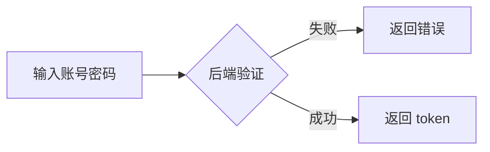
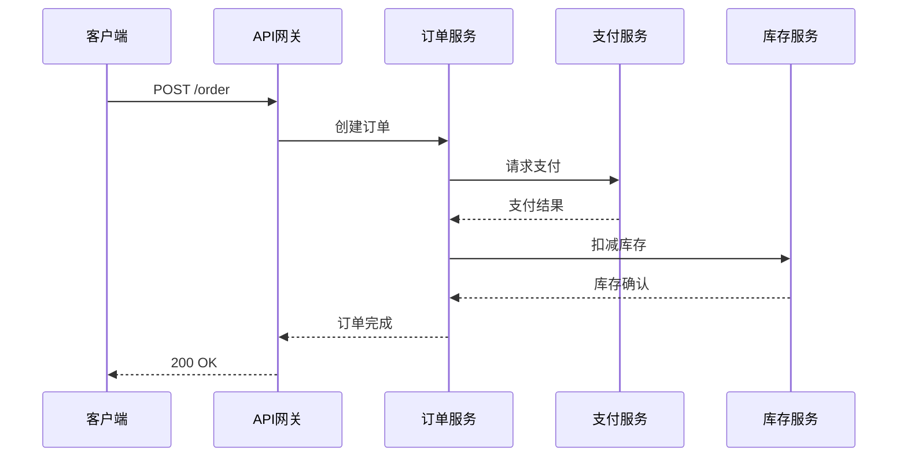

# Mermaid Diagram Generator

## 何时触发

关键词命中即触发：流程图/时序图/类图/状态图/ER图/甘特图/思维导图/架构图/可视化/画图。


把自然语言描述自动转成 mermaid 代码块。

## 何时使用

用户描述以下任一内容时自动出图：
- "X 流程怎么走" → 流程图
- "X 和 Y 怎么交互" → 时序图
- "X 类的关系" / "模块依赖" → 类图
- "状态怎么切换" → 状态图
- "数据库表关系" → ER 图
- "项目时间线" → 甘特图

## 支持的图类型

| 类型 | 关键字 | 用途 |
|---|---|---|
| `flowchart` | 流程/步骤/判断/分支 | 业务流程、决策树 |
| `sequenceDiagram` | 交互/调用/消息/响应 | API 调用、协议 |
| `classDiagram` | 类/继承/接口/依赖 | OO 设计、模块关系 |
| `stateDiagram-v2` | 状态/迁移/触发 | 状态机、工作流引擎 |
| `erDiagram` | 表/字段/外键/关系 | 数据库 schema |
| `gantt` | 排期/里程碑/依赖 | 项目管理 |
| `pie` | 占比/分布 | 数据可视化 |

## 生成流程

1. **识别图类型**：从用户描述的关键词判断
2. **抽取实体和关系**：找出节点、边、方向
3. **生成 mermaid 代码**：用代码块包起来（` ```mermaid `）
4. **自检**：
   - 标签不能有特殊字符（用引号包）
   - 方向选对（TD/LR/BT/RL）
   - 复杂图拆成多段

## 示例

### 输入
"用户登录流程：输入账号密码 → 后端验证 → 失败返回错误，成功返回 token"

### 输出


### 输入
"用户下单：客户端 → API 网关 → 订单服务 → 支付服务 → 库存服务"

### 输出


## 排版铁律

- **方向选择**：业务流程用 LR（横），决策树用 TD（竖）
- **节点标签**：超过 5 字符用引号 `["标签"]`
- **颜色**：不到必要时不用（用默认清晰）
- **注释**：用 `%% 注释`
- **不要**：emoji 在节点标签里、过长标签（>15字）、装饰性形状

## 何时不画图

- 描述模糊（"那个东西"）→ 先问清楚再画
- 太简单（≤3 节点）→ 用文字列表更清楚
- 用户明确说"不用图"→ 听用户的

## 输出后

画完图后顺便问：
- "需要加什么/改什么？"
- "要不要也画 X 相关流程？"（关联图）