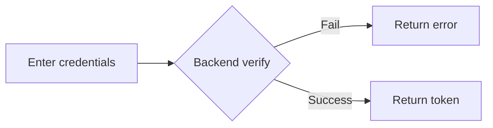
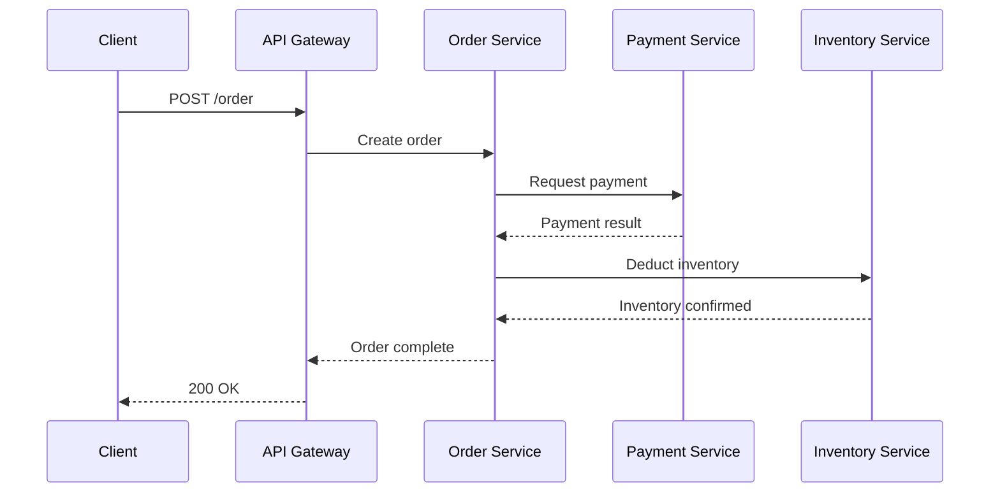

# Mermaid Diagram Generator

Turn natural-language descriptions into mermaid code blocks.

## When to use

Auto-diagram when the user describes:
- "how does X flow" → flowchart
- "how do X and Y interact" → sequence diagram
- "relationships between X classes" / "module dependencies" → class diagram
- "how do states transition" → state diagram
- "database table relations" → ER diagram
- "project timeline" → gantt

## Supported diagram types

| Type | Keywords | Use |
|---|---|---|
| `flowchart` | flow/steps/decision/branch | business flows, decision trees |
| `sequenceDiagram` | interaction/call/message/response | API calls, protocols |
| `classDiagram` | class/inheritance/interface/dependency | OO design, module relations |
| `stateDiagram-v2` | state/transition/trigger | state machines, workflow engines |
| `erDiagram` | table/field/foreign key/relation | database schemas |
| `gantt` | schedule/milestone/dependency | project management |
| `pie` | share/distribution | data visualization |

## Generation flow

1. **Identify diagram type** from keywords
2. **Extract entities and relations**: nodes, edges, directions
3. **Generate mermaid code** in a ` ```mermaid ` block
4. **Self-check**: quote labels with special chars / correct direction (TD/LR/BT/RL) / split complex diagrams

## Examples

### Input
"User login flow: enter credentials → backend verifies → failure returns error, success returns token"

### Output


### Input
"User places order: client → API gateway → order service → payment service → inventory service"

### Output


## Typography rules

- **Direction**: business flows LR (horizontal), decision trees TD (vertical)
- **Labels**: quote anything over 5 chars `["label"]`
- **Colors**: only when necessary (defaults are clear)
- **Comments**: `%% comment`
- **Never**: emoji in node labels, overlong labels (>15 chars), decorative shapes

## When not to diagram

- Description too vague ("that thing") → ask first
- Too simple (≤3 nodes) → a text list is clearer
- User explicitly says "no diagram" → listen

## After output

Ask: "Anything to add or change?" / "Want the related X flow too?" (linked diagrams)
